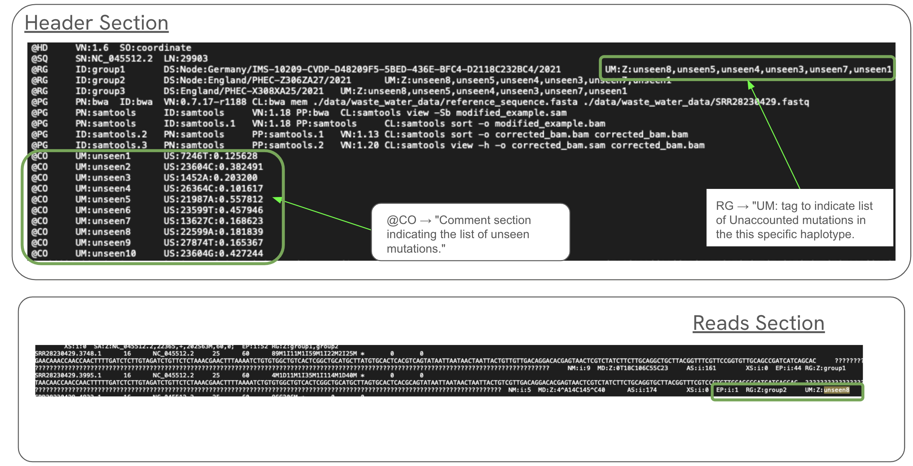

# Wastewater-Dasboard
** port forwarding is important while running from server. 

## Starting up the dashboard. 

### Before starting the dashboard

- Process the taxonium file.
    ```
    pip install taxoniumtools
    ```
    ```
    cd taxonium_component

    usher_to_taxonium -i input.pb -o output_taxonium.jsonl --name_internal_nodes -j config_public.json
    ```
- start taxonium backend
    ```
    node server.js --port 8080 --data_file output_taxonium.jsonl
    ```

### Running the Dashboard
```
cd server

pip install -r requirements.txt
```
```
python interface.py
```
** dashboard running on http://127.0.0.1:5000


## Bam File Data Format


Main BAM File.



## Miscellaneous commands

- SAM File to BAM File:
  ```
  samtools view -Sb input.bam -o output.bam
  ```
- sorting and indexing BAM file
  ```
  samtools sort input.bam -o output.bam && samtools index output.bam
  ```
